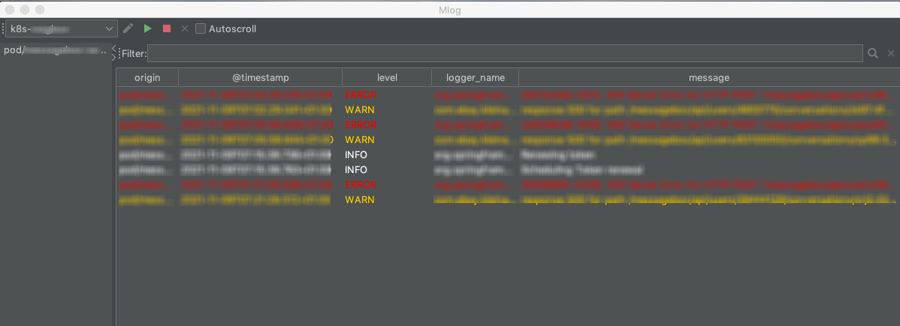

# MLog2 - Multi-tail log viewer
A log-viewer that can connect to multiple log-sources and can parse/filter log formats

# Features

* Extensible log-sources
* supports regex- and json-based log parsing
* supports filtering of logs via SQL-like query language

# Screenshot



# Configuration

to setup a log-view, you need to add a new configuration. This configuration can contain multiple log-sources, described by a url:

**examples**
```
k8s://your-service?n=namespace&c=container&since=40m
k8s+tail://your-service/tmp/access-log.2020-06-15.log?n=namespace
```

now you need to define the format of your logging:

**json:** simply list the fields you want to show up in the `LogConfiguration` (comma-separated)
**regex:** you need to define a regular expression with named capture-groups that will be used as columns in the log-view.
example for a regular expression
```
(?<date>\d{4}\-\d{2}\-\d{1,2}[ ]{1,2}\d{1,2}:\d{2}:\d{2}.\d{3})[ ]{1,2}(?<prio>INFO|DEBUG|WARN|ERROR)[ ](?<thread>\[.*?\])[ ](?<logger>.*?)(?<message>.*)

parses:
2017-01-01 01:11:12.233 INFO [main] org.app.mylogger some message 
```


## filtering

you can use sql like queries (where-clause) such as:

```sql
level = 'ERROR'
logger_name LIKE '%Logging%'
```

# Plugins

## Kubernetes

currently, only logging by kubernetes is supported.

* `k8s://` will use `kubectl log` functionality
* `k8s+tail://` will use `kubectl exec bash` combined with `tail` functionality on remote-side.

parameters supported are the usual ones by `kubectl` such as (n)amespace or (c)ontainer or `since` (optional)